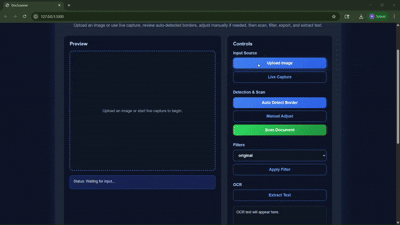

# DocScanner (OpenCV)

A smart document scanner built using OpenCV and Flask.

## Features
- Auto document edge detection
- Manual corner adjustment
- Image perspective transform
- Upload image & live capture
- Clean scanned output
- OCR text extraction from scanned documents

## Tech Stack
- Python
- OpenCV
- Flask
- HTML/CSS

## Demo



## How to Run

```bash
pip install -r requirements.txt
python app.py
